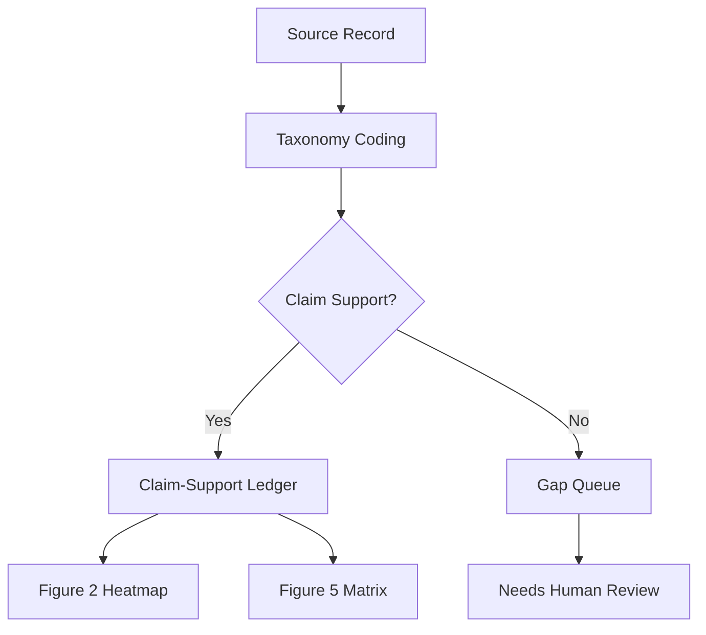

# paper-fragment-methods.md

## Figure 2: Edge-Case Coverage Heatmap (LIMEN Dashboard_PAR)
This figure visualizes the geographic and typological coverage of AI edge cases identified in the LIMEN corpus. The heatmap is constructed by:

1. **Source Aggregation**: Combining records from public regulatory sandboxes, procurement databases, and incident reports.
2. **Typology Mapping**: Categorizing edge cases using the LIMEN taxonomy (v2.3.1) across 12 themes (security failures, synthetic identity, etc.)
3. **Normalization**: Applying population and digital readiness indices to avoid raw count misinterpretations
4. **Dashboard Integration**: Exporting as GeoJSON with temporal layers for trend analysis

Key methodological choices:
- **Exclusion Criteria**: Records lacking geolocation data or clear AI attribution were excluded
- **Temporal Scope**: Covers Q1 2024 - Q2 2026
- **Validation**: Cross-checked with GAIA's public-evidence visibility layer

## Figure 5: Crosswalk Coverage Matrix

| Source Family       | LIMEN Coverage | PALLAS Source-Authority | GAIA Evidence Tier |
|---------------------|----------------|--------------------------|-------------------|
| Regulatory Notices  | 89%           | Level B                 | Tier 2            |
| Court Judgments     | 76%           | Level A                 | Tier 1            |
| Procurement Records  | 63%           | Level C                 | Tier 3            |

Constructed through:
- **Source Mapping**: Matching LIMEN records to GAIA/PALLAS identifiers
- **Authority Scoring**: Based on issuer credibility and legal force
- **Evidence Tiering**: Following GAIA's 4-tier system (Tier 1 = judicial, Tier 4 = industry reports)

## Figure 7: Claim-Support Flow

This flow ensures that only records with clear claim support appear in the final figures, maintaining methodological rigor.