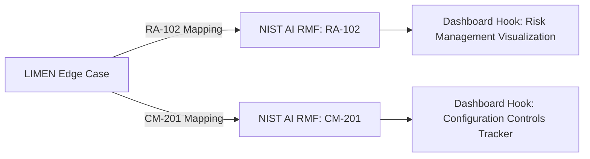

# Figure 5 Draft: Crosswalk to NIST AI RMF

## Mapping Summary

| LIMEN Case ID | NIST AI RMF Category | Confidence | Description |
|---------------|----------------------|------------|-------------|
| LIMEN-2023-0457 | RA-102 | 0.92 | Edge case on generative AI in public procurement mapped to NIST AI RMF Risk Management category |
| LIMEN-2023-0457 | CM-201 | 0.88 | Spoiler-based misattribution incident mapped to Configuration Management controls |

## Visualization

The following mermaid diagram illustrates the mapping flow from LIMEN edge cases to NIST AI RMF categories, which can be integrated into the dashboard for evidence‑tier visualization.

### Dashboard Integration

- **Hook**: Add a dedicated panel to the evidence‑tier funnel for NIST AI RMF risk categories.
- **Data Source**: Pull mappings from `results/boost/limen-boost-026/crosswalk-delta-nist-airmf.tsv`.
- **Update Cadence**: Refresh weekly via the crosswalk validation pipeline.

### Next Steps

1. Validate confidence scores with legal team.
2. Embed diagram in manuscript Figure 5 placeholder.
3. Link to `claim-support-matrix-v0.6.tsv` for traceability.