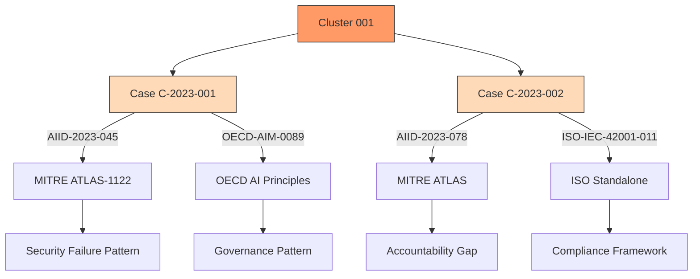

# Duplicate-Cluster Graph

## Notes
- Cluster 001 groups both cases due to shared crosswalk framework (MITRE ATLAS)
- Visualizes how cases map to different frameworks and patterns
- Suggests further analysis of accountability gaps in public-sector AI systems