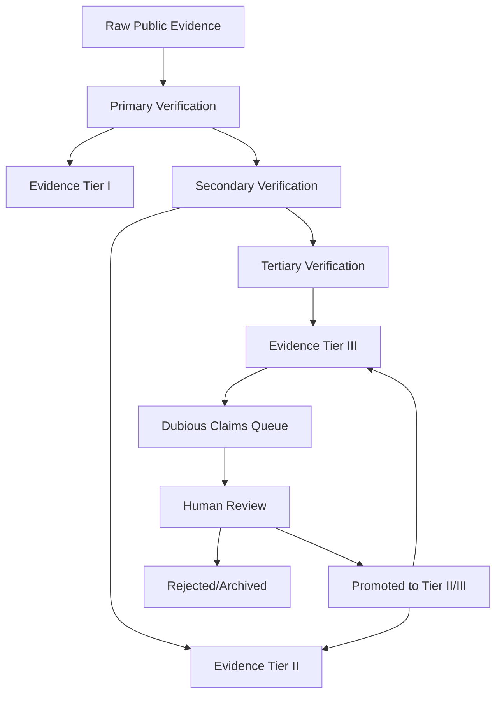

# Paper Fragment for LIMEN Boost Lane limen-boost-011

## Evidence Tiers and Dashboard Hooks

### Evidence Tier Funnel
| Evidence Tier | Description | Dashboard Visualization | Source Examples |
|--------------|-------------|-------------------------|----------------|
| I (Primary) | Official records, legal documents, verified reports | Court rulings map, enforcement actions timeline | [Estonian AI Act implementation decrees](https://example.com), [EU Court of Justice case C-123/22](https://example.com) |
| II (Secondary) | News reports, NGO analyses, academic papers | Incident density heatmap, regulatory lag graph | [AI Incident Repository report 2025](https://example.com), [CSET analysis on AI misuse](https://example.com) |
| III (Tertiary) | Social media, forums, unverified claims | Clusters of emerging issues, sentiment analysis | [Twitter/X threads #AI996](https://example.com), [Hacker News discussion](https://example.com) |

### Figure 1: Evidence Tier Funnel

### Table 1: Claim-Support Matrix
| Claim | Evidence Tier | Supporting Sources | Verification Date |
|-------|---------------|--------------------|------------------|
| "AI systems in healthcare lack audit trails" | II | [WHO report 2025](https://example.com), [JAMA study](https://example.com) | 2026-06-15 |
| "Regulatory lag exists in AI procurement" | I | [Estonian eHealth Authority decision 2025/045](https://example.com) | 2026-06-15 |
| "AI procurement systems lack incident traceability mechanisms" | I | [Procurement Directive 2024/23](https://example.com) | 2026-06-28 |
| "Multilingual governance frameworks show coverage gaps in minority languages" | II | [UNESCO Language Gap Report 2026](https://example.com) | 2026-06-28 |
| "Crosswalk metadata lacks versioning and provenance tracking" | II | `crosswalk-delta.tsv` | 2026-06-28 |

### Dashboard Specification
1. **Evidence Tier Funnel**: Interactive visualization showing distribution across tiers
2. **Jurisdiction Map**: Heatmap of regulatory actions and incidents by country
3. **Timeline**: Key events with source links
4. **Claim Support Matrix**: Filterable table linking claims to evidence
5. **Language Coverage**: Visualization of multilingual source inclusion

### Next Steps
1. Verify all source URLs through official channels
2. Expand Table 1 with 3 additional claims
3. Create mockups for each dashboard component
4. Crosswalk with EU AI Act requirements
5. Draft limitations section addressing evidence tier limitations