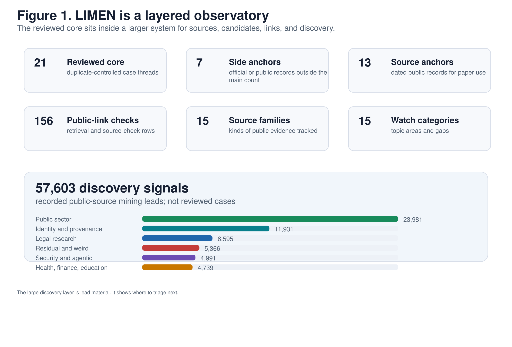
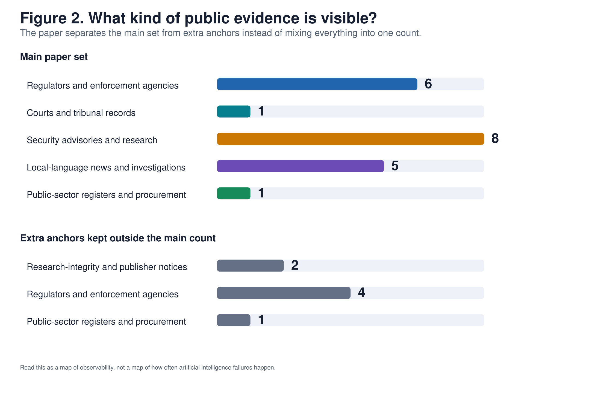
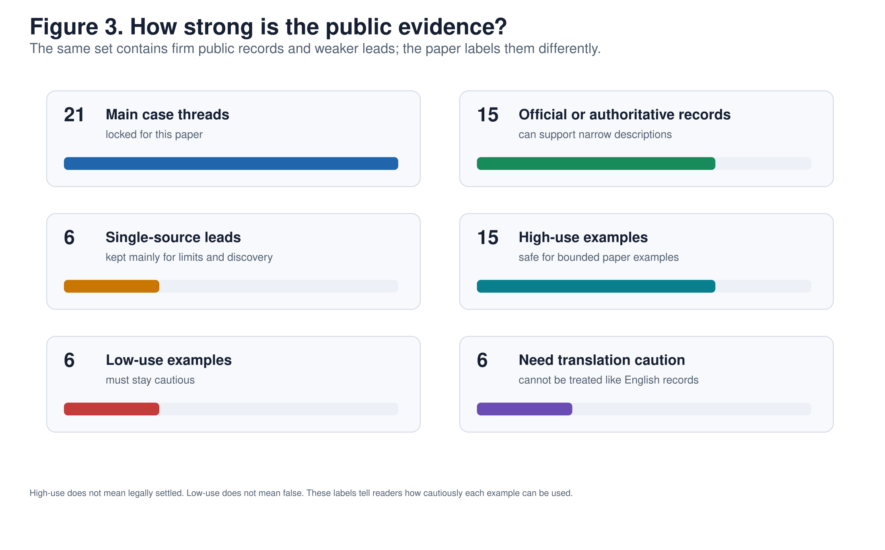
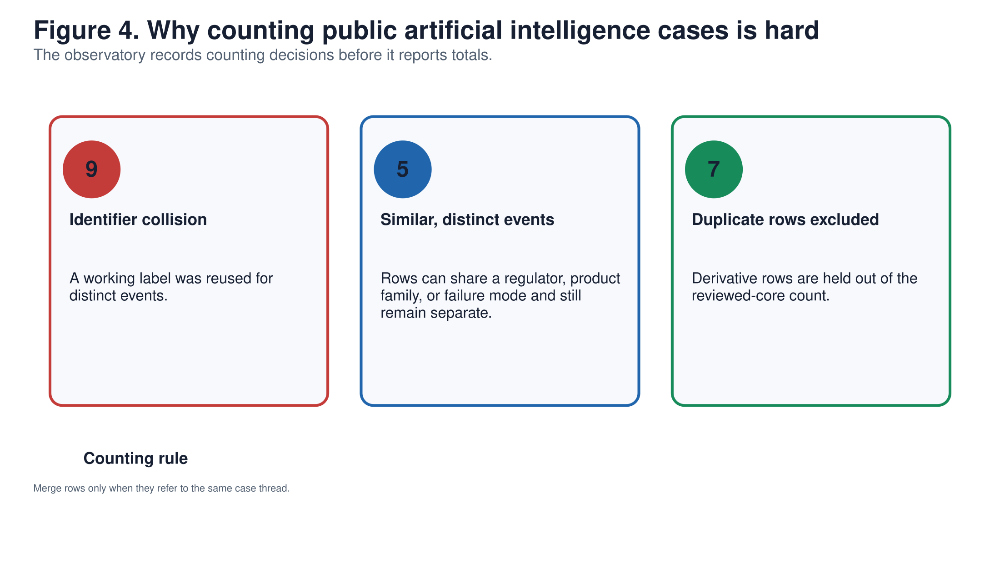
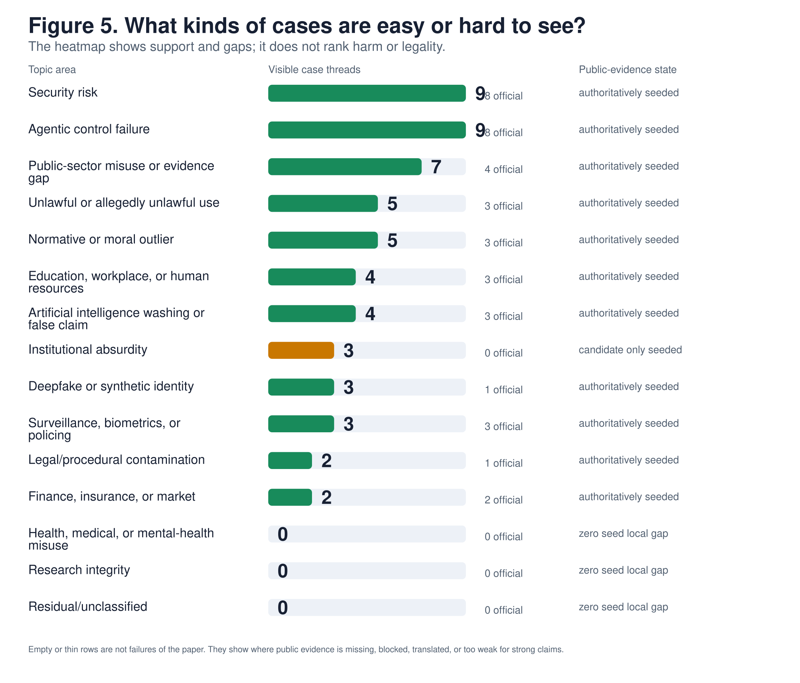
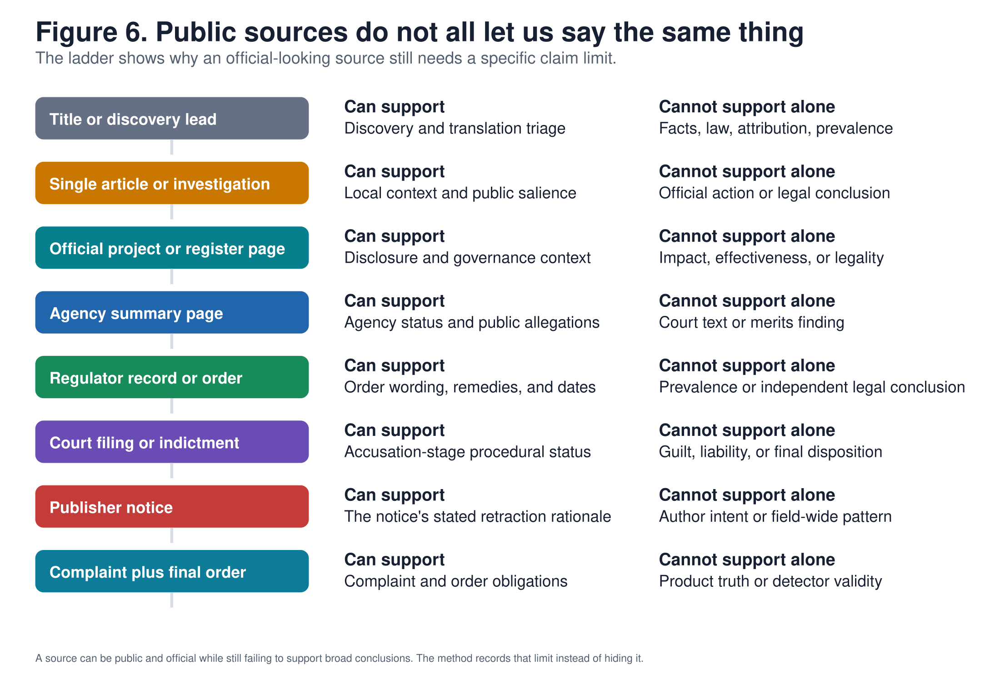

# Abstract

Artificial intelligence governance research now faces a practical evidence problem. Public records appear across regulator pages, court-facing documents, security advisories, public-sector registers, publisher notices, local-language media, and scattered discovery leads. These materials are valuable, but they cannot be collapsed into one flat incident list.

LIMEN is a public-source observatory for artificial intelligence edge cases. The current paper package contains a reviewed core of 21 duplicate-controlled case threads, seven official or public side anchors, 13 dated public-record anchors, 15 source-family rows, 15 watch categories, 156 public-link checks, and 57,603 recorded discovery signals from six public-source mining lanes. The large discovery layer is lead material, not reviewed-case evidence. Its value is coverage pressure: it shows where the observatory should look next.

The contribution is a working evidence system. LIMEN separates reviewed cases from candidate leads, records source type and evidence strength, controls duplicate collisions, preserves translation caution, records public-link limits, and assigns bounded claim scope. The result is not a prevalence estimate, legal classifier, or country ranking. It is a scalable method for turning messy public evidence into a research-grade observatory.

# 1. Motivation

Artificial intelligence edge cases do not arrive in one format. A regulator record about an artificial intelligence legal-service claim, a publisher retraction involving unverifiable references, a security advisory about tool-chain compromise, and a local-language public-sector story may all matter for governance research. They differ in source type, legal status, document depth, and what they can support.

The research problem is therefore not scarcity. It is disciplined scale. A useful atlas must collect widely while keeping reviewed cases, candidate leads, source anchors, access limits, and uncertain categories distinct. LIMEN is built for that job.

# 2. Observatory Scale

This paper uses the LIMEN paper package as its public-source snapshot.^[Counts refer to the June 7, 2026 public-source package. Later additions should be treated as new material unless the package is deliberately recomputed.]

| Layer | Count | Role |
|---|---:|---|
| Reviewed core | 21 | Duplicate-controlled case threads used for bounded analysis |
| Side anchors | 7 | Official or public records kept outside the reviewed core |
| Source anchors | 13 | Dated public records used for source-depth and methods claims |
| Public-link checks | 156 | Source-check and retrieval-limit rows |
| Source families | 15 | Kinds of public evidence tracked |
| Watch categories | 15 | Topic areas and gaps tracked by the taxonomy |
| Discovery signals | 57,603 | Recorded public-source mining leads, not reviewed cases |

{ width=100% }

The reviewed core gives the paper stable examples. The side anchors and source anchors give the paper document depth. The public-link checks keep source availability visible. The discovery layer gives the observatory its scale.

# 3. Design

## 3.1 Public Sources

LIMEN uses public sources. Paywalled, blocked, sealed, private, rate-limited, or restricted material is recorded as unavailable rather than bypassed. This keeps the paper aligned with what a public observer can verify.

## 3.2 Reviewed Core And Candidate Leads

The observatory separates reviewed case threads from candidate leads. Reviewed case threads have been duplicate-controlled and assigned evidence strength, source family, translation status, and claim scope. Candidate leads remain useful, but they do not carry the same evidentiary weight.

The 57,603 discovery signals are therefore a queueing layer. They expand coverage, reveal source routes, and create triage pressure. They are not counted as confirmed cases.

## 3.3 Identifiers And Duplicate Control

Stable public identifiers separate case handles from working labels. Duplicate review classifies rows as same case thread, similar but distinct event, or label collision before counts are reported. At this scale, raw rows are not usable evidence.

## 3.4 Source Type And Evidence Strength

LIMEN codes source type separately from topic. Agency summaries, regulator orders, court-facing documents, security advisories, publisher notices, public-sector registers, and media investigations support different claims.

The paper uses three evidence-strength classes:

| Evidence class | Meaning |
|---|---|
| Official or authoritative public record | A regulator, court-facing source, public body, publisher, issuer, or comparable authority supports a narrow descriptive claim. |
| Direct official source resolved from a lead | A lead was traced back to an official public source. |
| Single public source | One public source supports a lead, but stronger corroboration, translation review, or document depth is still missing. |

## 3.5 Claim Scope

Every reviewed row records claim scope. A complaint supports the fact that allegations were made. A charging document supports accusation-stage status. A public register supports disclosure. A publisher notice supports the notice's stated reason. A security advisory supports a technical risk description. None of these source types automatically supports prevalence, legal outcome, compliance, certification, or sector-wide claims.

# 4. Results

## 4.1 Source Families

The reviewed core is not one source type. It contains regulator and enforcement records, security advisories, local-language reporting, court-facing material, public-sector records, and publisher or regulator side anchors.

{ width=100% }

This distribution is useful because it makes source dependence visible. It also shows where the current core is strong and where the larger discovery layer should feed future review.

## 4.2 Evidence Strength

Most reviewed threads have official or authoritative public support. A smaller group remains single-source and is retained for discovery pressure, language coverage, or methods limits.

{ width=100% }

Weaker rows remain in the appropriate layer rather than being discarded or promoted.

## 4.3 Duplicate Control

Large public-source collection creates collisions. LIMEN records whether rows are duplicates, merely similar, or affected by label reuse.

{ width=100% }

This is a core research control. Without it, scale becomes noise.

## 4.4 Watch Categories

The taxonomy shows visible areas and gaps. Security risk and agentic-control cases are visible in the reviewed core. Public-sector, enforcement, identity, education, and procedural categories are present but uneven. Health, research-integrity, and residual categories need more reviewed rows.

{ width=100% }

The large discovery layer supplies future candidates without treating every signal as a reviewed case.

## 4.5 Source Depth

Public sources differ in what they can carry. A discovery lead, a media article, a public register, an agency summary, a regulator order, a court-facing document, a publisher notice, and a complaint-plus-order package support different levels of detail.

{ width=100% }

The ladder lets the dashboard and manuscript use large coverage without laundering weak or partial evidence into stronger claims.

# 5. What The Large Set Changes

The large set changes the research object. LIMEN is not a small handpicked catalog. It is an observatory with a reviewed core, candidate queues, source anchors, public-link checks, and discovery pressure.

That scale makes three things possible.

First, coverage can be managed instead of guessed. Sparse categories become visible. Thin source families become visible. Translation-dependent lanes become visible.

Second, promotion can be deliberate. A new lead becomes valuable when it improves source quality, fills a category gap, resolves a duplicate problem, adds a jurisdiction or language, or strengthens document depth.

Third, the public dashboard can show uncertainty directly. Reviewed cases, side anchors, candidate examples, link limits, and source families can be displayed as separate layers rather than flattened into one count.

# 6. Concrete Actions

LIMEN should now be operated as a full observatory, not as a smaller list.

1. Keep the reviewed core stable for this paper while the discovery layer continues to grow.
2. Triage the 57,603 recorded discovery signals by source family, language, jurisdiction, and category gap.
3. Promote only rows that improve public evidence quality or coverage balance.
4. Refresh the public dashboard with separate layers for reviewed cases, side anchors, candidate leads, public-link checks, and discovery signals.
5. Complete an independent second-coder pass on evidence strength, source family, category, and claim scope.
6. Archive the paper package so the manuscript, figures, source tables, and dashboard exports can be inspected together.

# 7. Limitations

The discovery layer is large, but it is not deduplicated reviewed evidence. It is lead material.

The reviewed core is intentionally controlled. It supports methods and observatory claims, not prevalence, trend, sector, or jurisdiction comparisons.

Some official records remain narrow. Agency summaries are not court findings. Charging documents are not outcomes. Final orders do not automatically support broad legal conclusions. Public-sector registers do not prove impact or effectiveness. Publisher notices do not prove field-wide patterns.

The reliability check remains unfinished until a real second reviewer codes the prepared sample.

# 8. Conclusion

LIMEN is a large public-source observatory for artificial intelligence edge cases. Its value is not only the reviewed case list. Its value is the full system: reviewed core, side anchors, source anchors, link checks, source families, watch categories, and a large discovery layer feeding future review.

The next step is not to shrink the system into a tidy list. The next step is to operate it at full scale: keep the reviewed core stable, triage the discovery layer aggressively, promote rows with better evidence, and refresh the public dashboard so users can see both scale and uncertainty.

# Data And Public Source Availability

A frozen artifact bundle accompanies this draft. The public-facing paper should cite the bundle by archive or repository locator once the deposit location is chosen.

Selected public source examples:

- U.S. Federal Trade Commission, DoNotPay matter: <https://www.ftc.gov/legal-library/browse/cases-proceedings/donotpay>
- U.S. Federal Trade Commission, Workado / Content at Scale artificial intelligence matter: <https://www.ftc.gov/legal-library/browse/cases-proceedings/2323092-content-scale-ai>
- Springer Nature, Intensive Care Medicine retraction notice: <https://link.springer.com/article/10.1007/s00134-024-07752-6>
- Springer Nature, book/chapter retraction notice: <https://link.springer.com/content/pdf/10.1007/978-981-97-9914-5_1.pdf>
- Danish Datatilsynet public-sector artificial intelligence decision: <https://www.datatilsynet.dk/afgoerelser/afgoerelser/2024/jun/udvikling-af-ai-loesning-til-sagsbehandling-paa-su-omraadet>
